# Guía por sección — PLIFE Growth OS

> **Histórico (FASE 15C):** **Compliance fue removido del producto.** Ya no existe la sección/menú Compliance ni la ruta `/app/compliance`. Las menciones a "Compliance" en este documento son históricas. Ver `docs/product/compliance-removal-15c.md`.
>
> **Actualización (FASE 15D):** La sección **"Motor IA"** se renombró a **"Motores"** (motores comerciales) y **"Copiloto IA"** aparece como **"Copiloto"**. Las menciones previas reflejan la denominación anterior. Ver `docs/product/commercial-engines-redesign-15d.md`.

Referencia rápida pantalla por pantalla. Pensada para consulta diaria o para alimentar NotebookLM.

---

## PLIFE Hoy

| | |
|---|---|
| **Para qué sirve** | Pantalla principal del día: foco inmediato y seguimiento comercial |
| **Qué se ve vacío** | Sin seguimientos pendientes; guía de primeros pasos |
| **Cuándo usarla** | Al iniciar y cerrar cada jornada |
| **Qué datos cargar** | No se cargan datos aquí — se alimenta de oportunidades |
| **Qué revisar** | Vencidas, para hoy, sin próximo paso, estancadas |
| **Qué hacer después** | Ir a la oportunidad y actualizar estado o próximo paso |
| **Errores comunes** | Ignorar vencidas; no definir próximos pasos en otras pantallas |
| **Captura** |  · 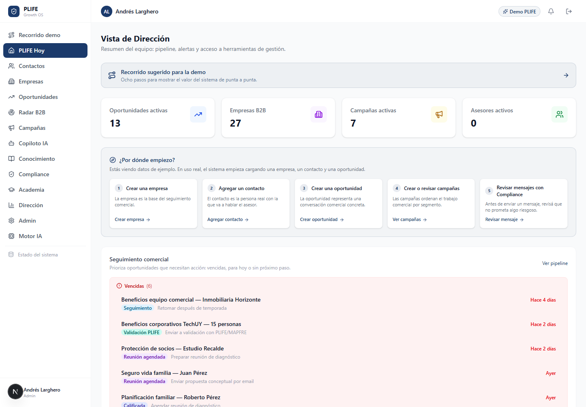 |

---

## Empresas

| | |
|---|---|
| **Para qué sirve** | Registrar y organizar organizaciones objetivo B2B |
| **Qué se ve vacío** | Mensaje “todavía no hay empresas”; botón Nueva empresa |
| **Cuándo usarla** | Al detectar un negocio objetivo; antes de contactos |
| **Qué datos cargar** | Nombre*, rubro, ciudad, web, notas |
| **Qué revisar** | Advertencias de duplicado; estado comercial |
| **Qué hacer después** | Agregar contacto; crear oportunidad si hay interés |
| **Errores comunes** | Duplicar empresas; cargar sin rubro ni contexto |
| **Captura** | 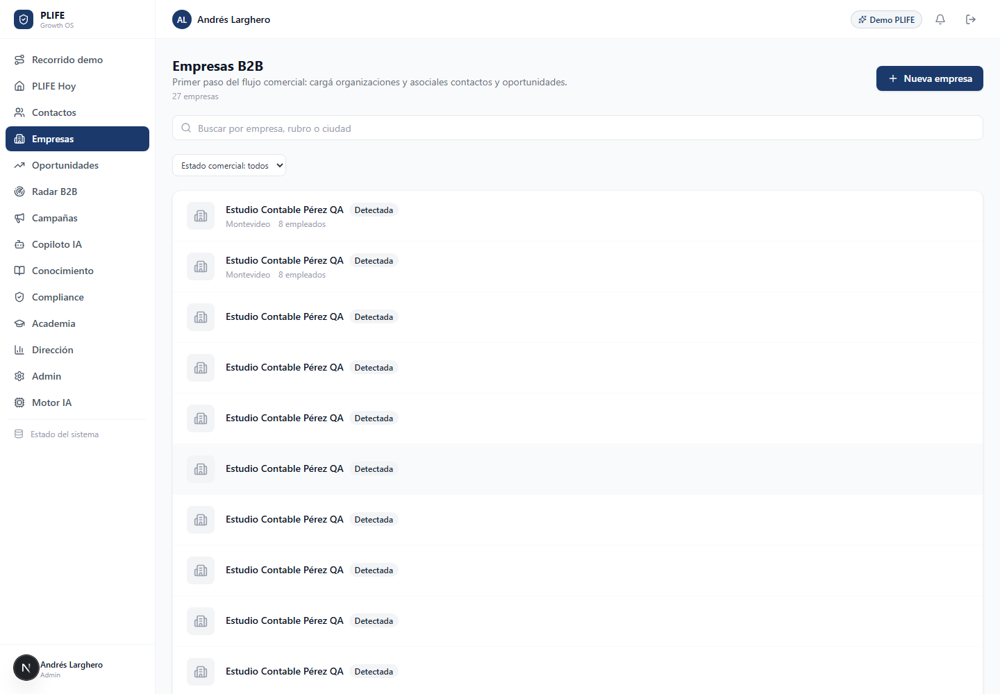 · 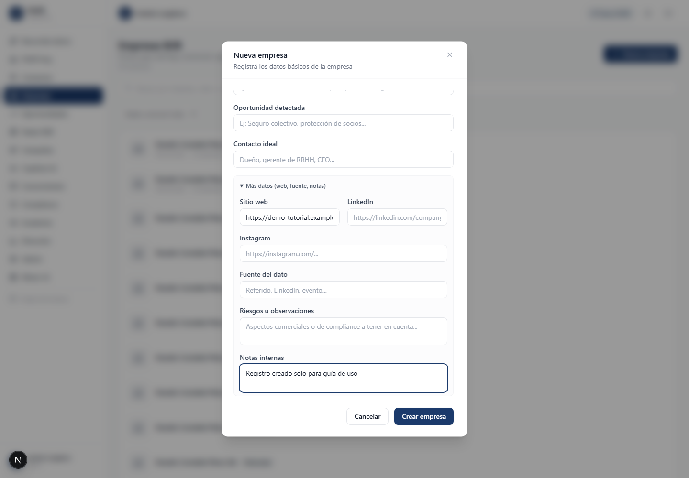 · 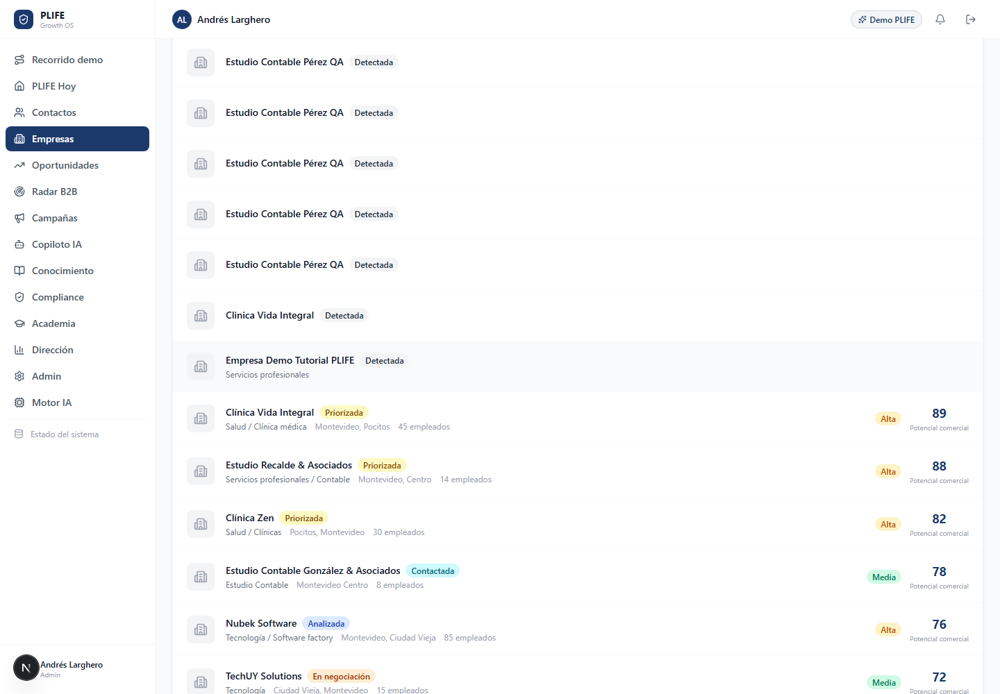 |

---

## Contactos

| | |
|---|---|
| **Para qué sirve** | Registrar personas con las que se conversa |
| **Qué se ve vacío** | Sin contactos; invitación a crear el primero |
| **Cuándo usarla** | Tras identificar interlocutor en una empresa |
| **Qué datos cargar** | Nombre*, apellido*, cargo, email, teléfono, empresa |
| **Qué revisar** | Duplicados; consentimiento de datos |
| **Qué hacer después** | Crear oportunidad si hay interés comercial |
| **Errores comunes** | Contacto sin empresa; email duplicado |
| **Captura** | 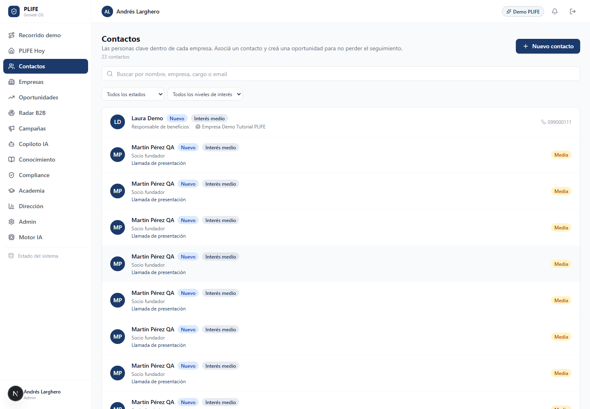 · 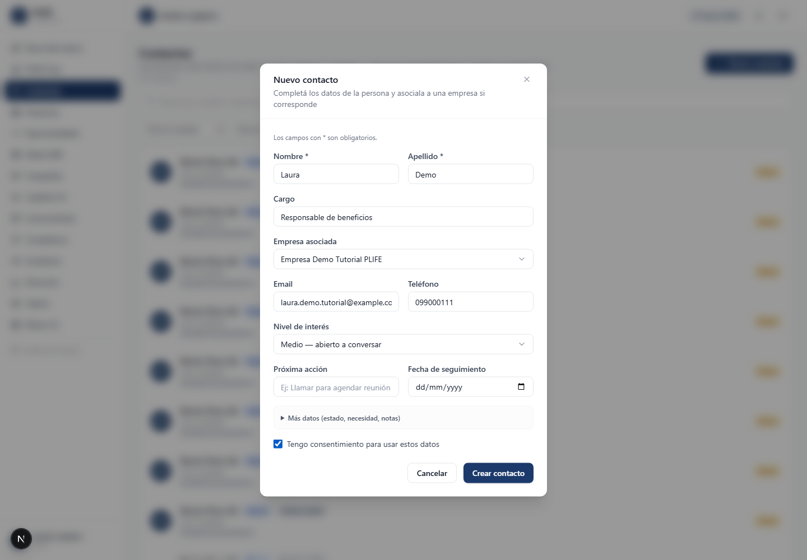 · 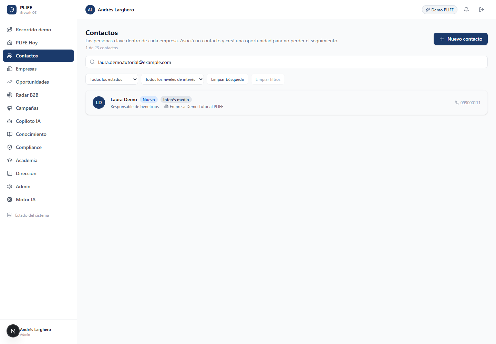 |

---

## Oportunidades

| | |
|---|---|
| **Para qué sirve** | Registrar conversaciones comerciales con seguimiento |
| **Qué se ve vacío** | Pipeline sin tarjetas; invitación a crear |
| **Cuándo usarla** | Cuando hay interés real post-conversación |
| **Qué datos cargar** | Título*, tipo, etapa, próximo paso, fecha |
| **Qué revisar** | Etapa actual; fecha vencida o ausente |
| **Qué hacer después** | Actualizar en Hoy; registrar actividad |
| **Errores comunes** | Sin próximo paso; sin fecha; oportunidades “fantasma” |
| **Captura** | 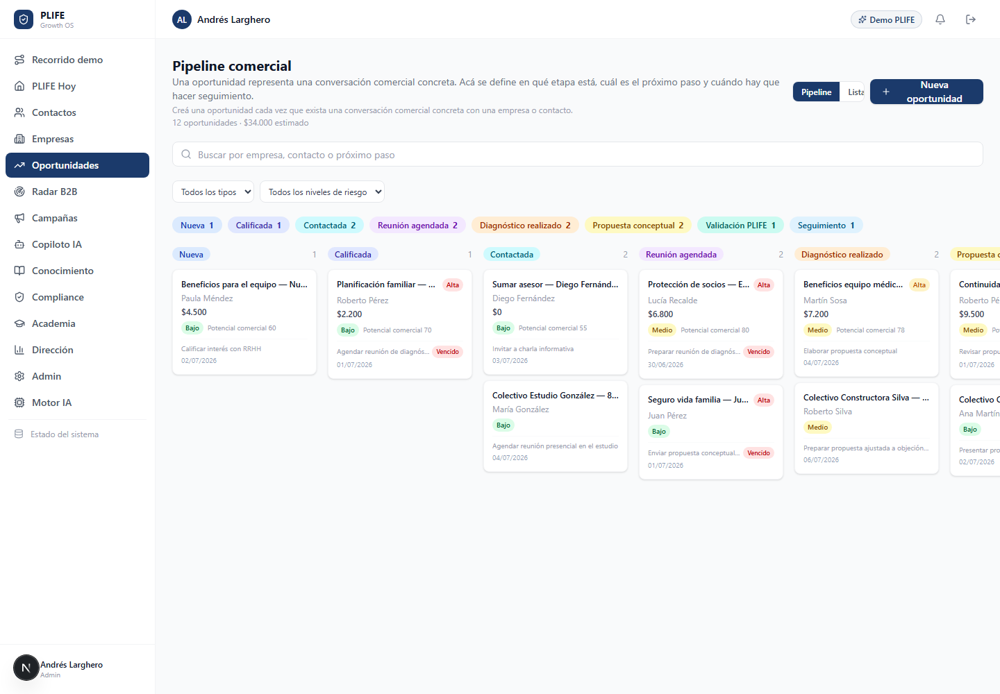 · 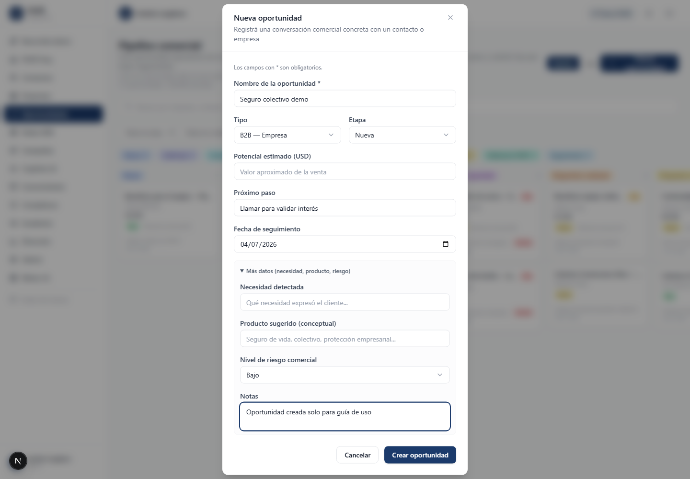 · 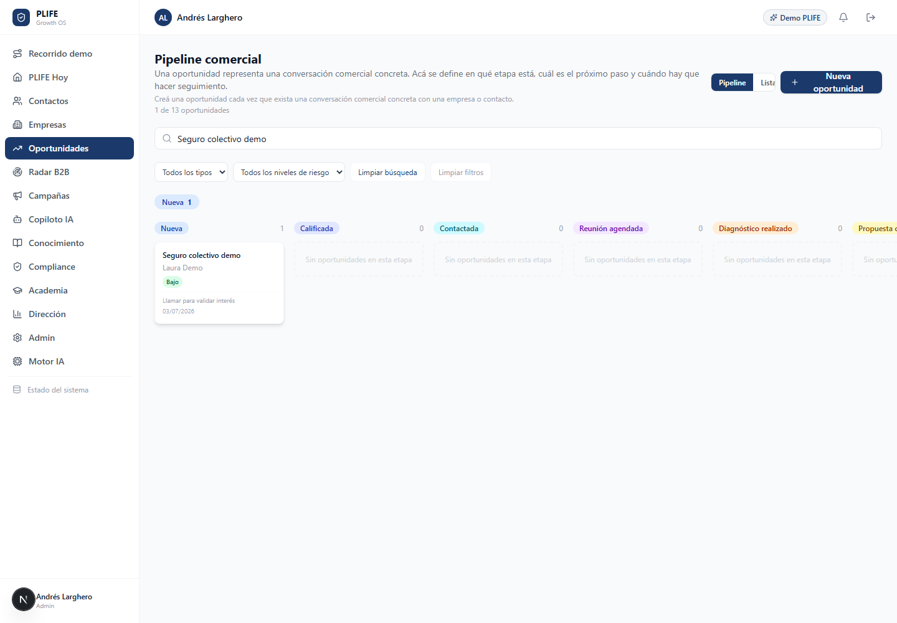 |

---

## Campañas

| | |
|---|---|
| **Para qué sirve** | Planificar acciones comerciales por segmento |
| **Qué se ve vacío** | Sin campañas; guía operativa |
| **Cuándo usarla** | Al definir enfoque para un segmento de mercado |
| **Qué datos cargar** | Nombre*, objetivo*, segmento, estado |
| **Qué revisar** | Vínculos con empresas/oportunidades; próximo paso |
| **Qué hacer después** | Trabajar empresas del segmento; registrar oportunidades |
| **Errores comunes** | Crear campaña sin ejecución; esperar envíos automáticos |
| **Captura** | 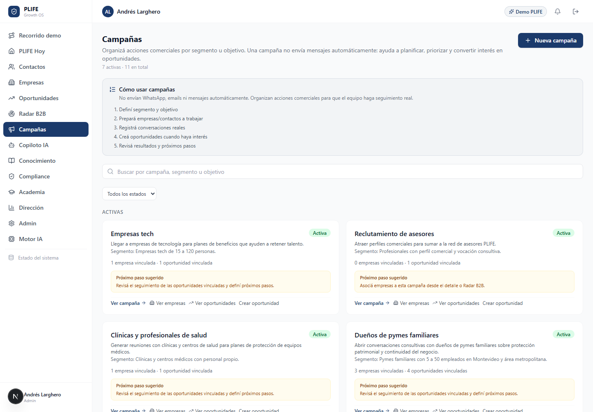 · 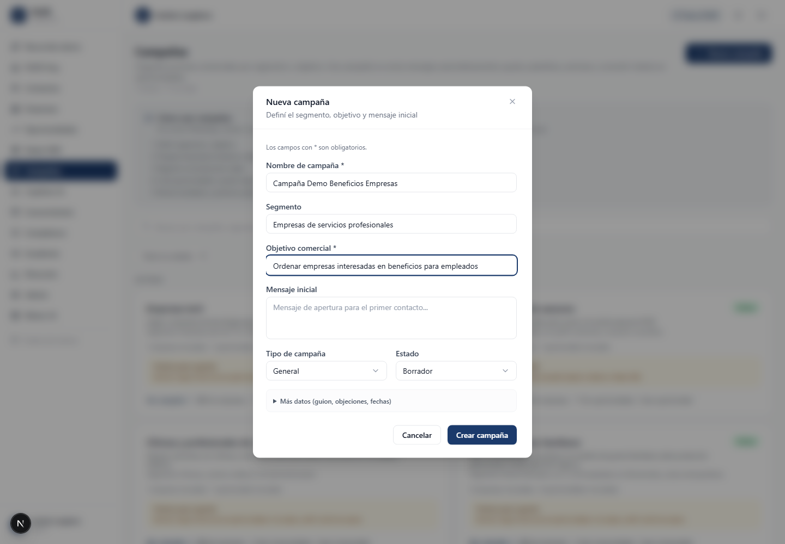 · 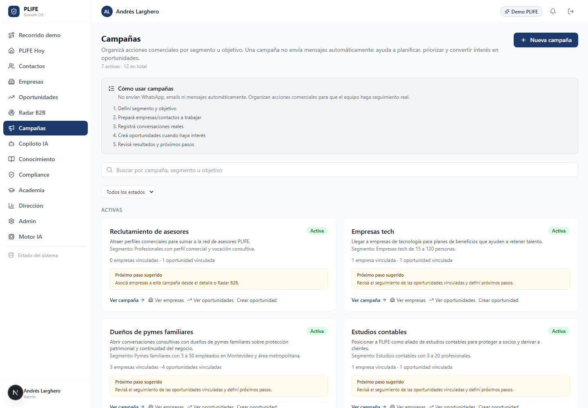 |

---

## Radar B2B

| | |
|---|---|
| **Para qué sirve** | Detectar señales de potencial comercial |
| **Qué se ve vacío** | Puede mostrar guía sin señales procesadas |
| **Cuándo usarla** | Prospección ordenada; revisión periódica |
| **Qué datos cargar** | No carga directa — convierte señales en empresa/contacto |
| **Qué revisar** | Señales sin convertir en seguimiento |
| **Qué hacer después** | Crear empresa/contacto/oportunidad según corresponda |
| **Errores comunes** | Acumular señales sin acción; usar como lista pasiva |
| **Captura** | 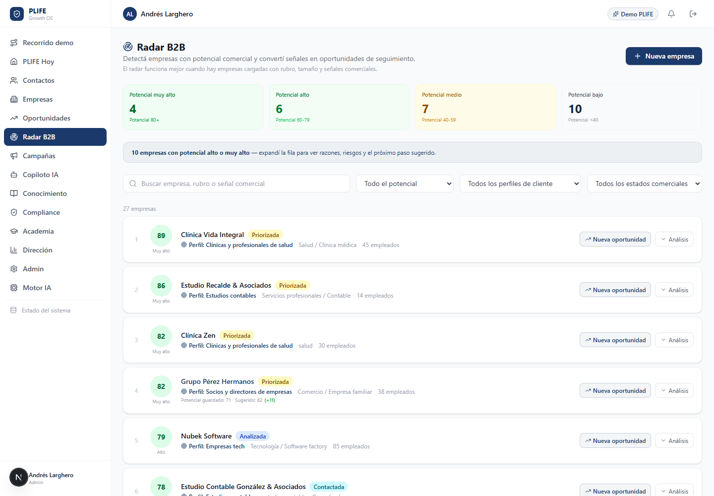 |

---

## Motor IA

| | |
|---|---|
| **Para qué sirve** | Apoyo para análisis, mensajes y lectura comercial |
| **Qué se ve vacío** | Configuración o pantalla de perfiles según rol |
| **Cuándo usarla** | Preparar seguimiento o borrador de mensaje |
| **Qué datos cargar** | Contexto en formularios de análisis (no automático) |
| **Qué revisar** | Siempre revisar salida antes de usar con cliente |
| **Qué hacer después** | Pasar mensaje por Compliance si es sensible |
| **Errores comunes** | Confiar ciegamente; usar como cálculo de prima |
| **Captura** | 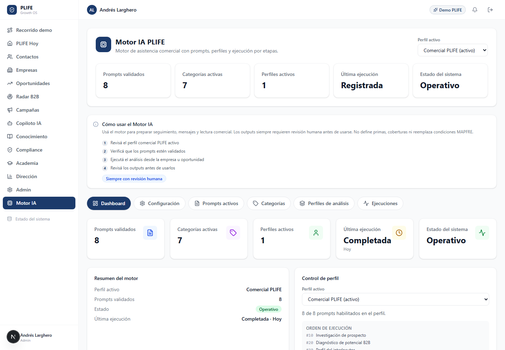 |

---

## Compliance

| | |
|---|---|
| **Para qué sirve** | Revisar mensajes y detectar riesgos en el texto |
| **Qué se ve vacío** | Formulario de ingreso de mensaje |
| **Cuándo usarla** | Antes de enviar comunicaciones sensibles |
| **Qué datos cargar** | Texto del mensaje a revisar |
| **Qué revisar** | Alertas y sugerencias — con criterio humano |
| **Qué hacer después** | Ajustar mensaje; consultar área legal si hace falta |
| **Errores comunes** | Usar como aprobación legal automática |
| **Captura** | 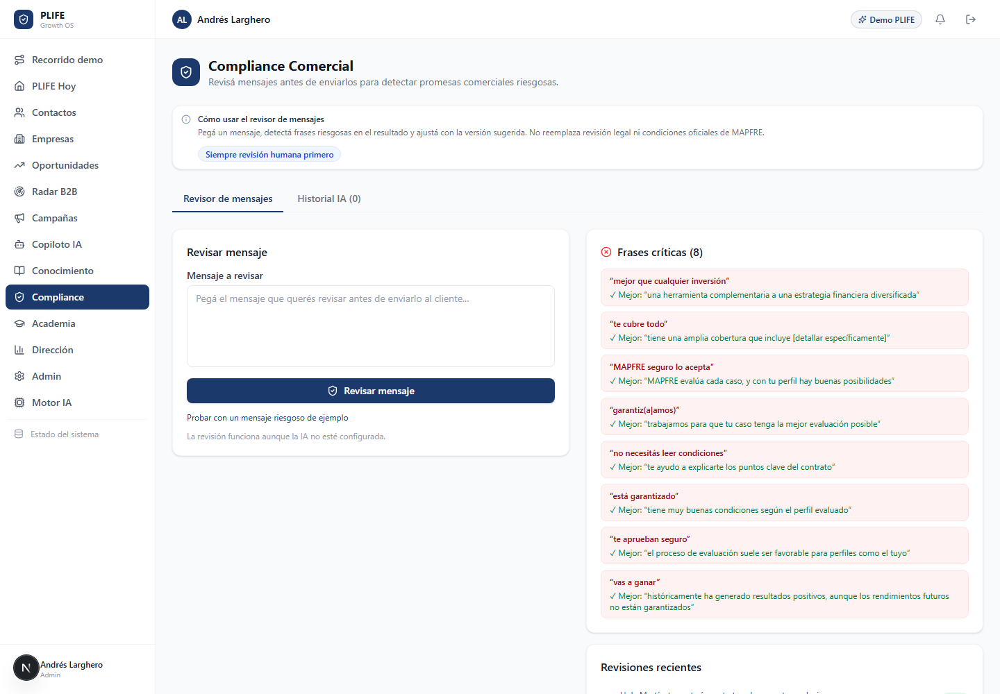 |

---

## Dirección

| | |
|---|---|
| **Para qué sirve** | Vista de gestión: equipo, pipeline, alertas |
| **Qué se ve vacío** | Métricas en cero si no hay datos cargados |
| **Cuándo usarla** | Revisión semanal o de gestión |
| **Qué datos cargar** | No es pantalla de carga — consume datos del equipo |
| **Qué revisar** | Oportunidades sin seguimiento; campañas activas |
| **Qué hacer después** | Definir prioridades y acompañar asesores |
| **Errores comunes** | Usarla para carga diaria individual |
| **Captura** | 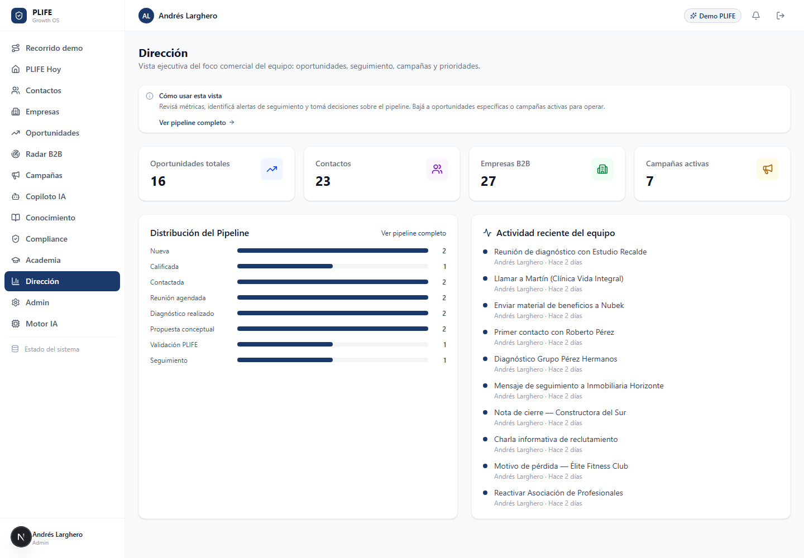 |

---

## Admin

| | |
|---|---|
| **Para qué sirve** | Configuración y control interno |
| **Qué se ve vacío** | Panel de administración según permisos |
| **Cuándo usarla** | Solo usuarios con rol administrativo |
| **Qué datos cargar** | Configuración de sistema (no uso comercial diario) |
| **Qué revisar** | Estado del sistema; permisos |
| **Qué hacer después** | Volver a flujo comercial en Hoy |
| **Errores comunes** | Usar Admin para tareas de asesor |
| **Captura** | 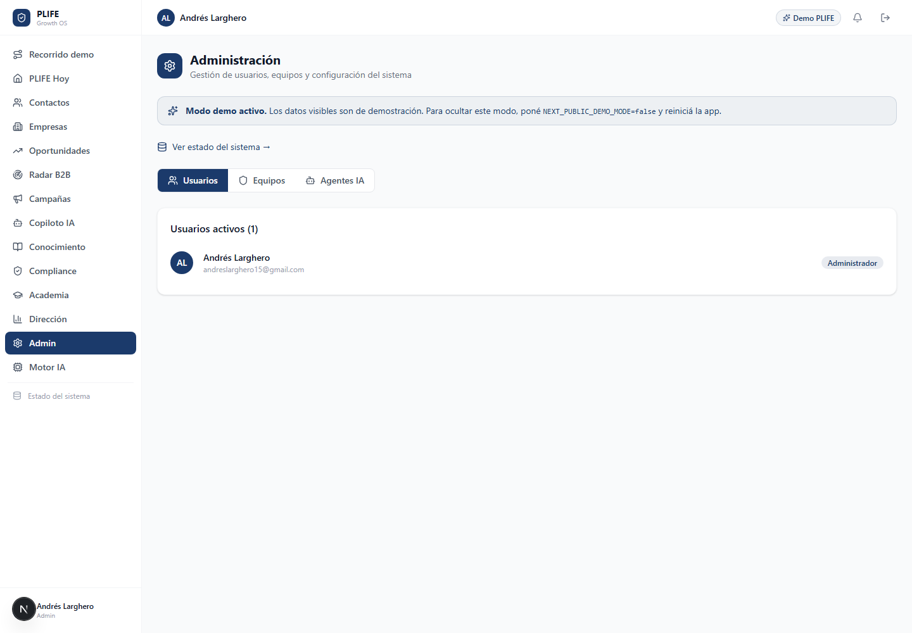 |
