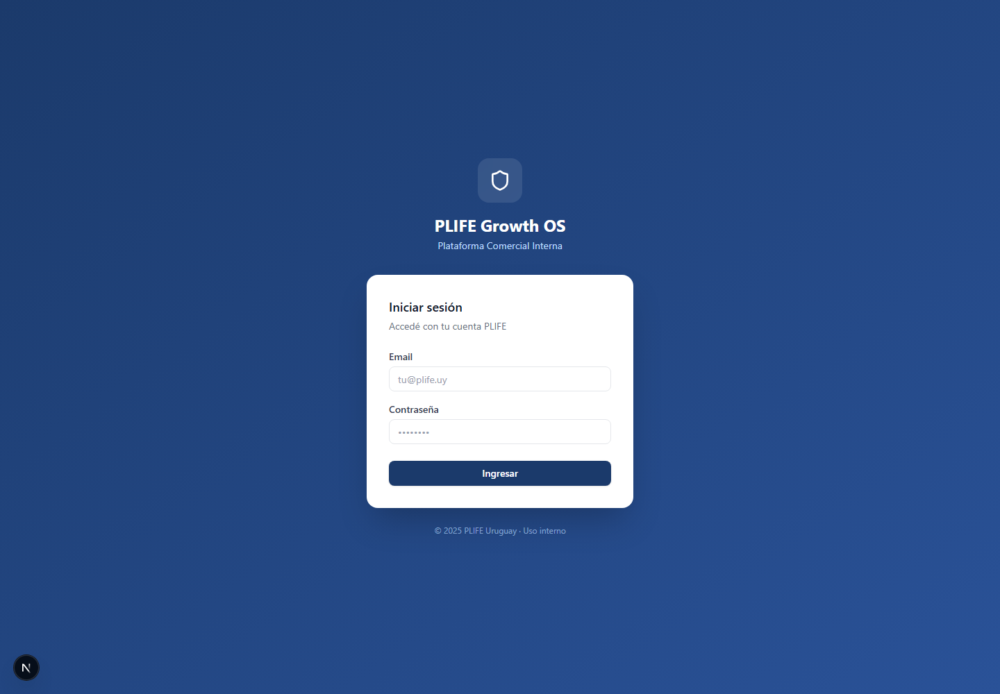

# Manual de uso — PLIFE Growth OS

> **Histórico (FASE 15C):** **Compliance fue removido del producto.** Ya no existe la sección/menú Compliance ni la ruta `/app/compliance`. Las menciones a "Compliance" en este documento son históricas y no reflejan el producto actual. Ver `docs/product/compliance-removal-15c.md`.
>
> **Actualización (FASE 15D):** La sección **"Motor IA"** se renombró a **"Motores"** (motores comerciales) y **"Copiloto IA"** aparece como **"Copiloto"**. Las menciones previas reflejan la denominación anterior. Ver `docs/product/commercial-engines-redesign-15d.md`.

Guía completa para usuarios comerciales que entran por primera vez. Explica qué es el sistema, cómo empezar desde cero y cómo usar cada sección en el día a día.

> **Importante:** PLIFE Growth OS ordena el trabajo comercial. No reemplaza sistemas oficiales de MAPFRE, no calcula pólizas ni automatiza ventas.

---

## 1. Qué es PLIFE Growth OS

PLIFE Growth OS es una plataforma interna para **ordenar el trabajo comercial** del equipo PLIFE:

- **Empresas** — organizaciones objetivo del trabajo B2B
- **Contactos** — personas con las que se conversa
- **Oportunidades** — conversaciones comerciales concretas con seguimiento
- **Campañas** — acciones comerciales planificadas por segmento
- **PLIFE Hoy** — foco del día y seguimiento comercial
- **Radar B2B** — detección de potencial comercial
- **Motor IA** — apoyo para análisis y redacción (con revisión humana)
- **Compliance** — revisión de mensajes antes de enviar
- **Dirección** — vista de gestión del equipo
- **Admin** — configuración interna

El sistema **no envía WhatsApp, email ni mensajes automáticos**. **No hace scraping** ni promete conversiones automáticas.

---

## 2. Cómo se usa el sistema en general

Flujo vigente (versión actual):

```
Empresa → Contacto → Oportunidad → Seguimiento → Campaña / Radar → Motor IA → Compliance → Dirección
```

Cada paso construye sobre el anterior. Sin empresa y contacto, el seguimiento se desordena. Sin próximo paso en la oportunidad, PLIFE Hoy no puede ayudar al asesor.

> **Nota de roadmap — Fase 14:** el modelo evolucionará hacia **Lead-first**. El lead será el punto de entrada general antes de empresa y contacto. Empresa y Contacto pasarán a ser datos asociados al lead. Oportunidad se mantendrá como entidad separada, creándose solo cuando el lead esté calificado. Ver `docs/product/lead-pipeline-concept-redesign.md`.

---

## 3. Primer ingreso: sistema vacío

### Iniciar sesión

1. Abrí la URL de PLIFE Growth OS.
2. Ingresá email y contraseña.
3. Presioná **Ingresar**.



### Primera vista: PLIFE Hoy

Al entrar, lo normal es ver **poca o ninguna actividad**. El sistema muestra guías de inicio y el bloque de seguimiento vacío.


**Qué hacer primero:**
1. Revisar el menú lateral (sidebar).
2. Leer la guía de primeros pasos si aparece.
3. Crear la **primera empresa** — es la base de todo el flujo.

---

## 4. Paso 1 — Crear la primera empresa

### Qué es una empresa

Una **empresa** es una organización con potencial comercial: un estudio contable, una clínica, una pyme de servicios, etc.

### Cuándo crearla

- Cuando identificás un negocio objetivo para seguimiento B2B.
- Antes de cargar contactos (idealmente).
- Cuando una señal del Radar B2B se confirma como oportunidad real.

### Qué datos cargar

| Campo | Obligatorio | Ejemplo tutorial |
|-------|-------------|------------------|
| Nombre | Sí | Empresa Demo Tutorial PLIFE |
| Rubro | Recomendado | Servicios profesionales |
| Sitio web | Opcional | https://demo-tutorial.example.com |
| Notas | Opcional | Registro creado solo para guía de uso |

### Cómo evitar duplicados

Si el sistema detecta una empresa parecida, mostrará una **advertencia**. Revisá el registro existente antes de crear uno nuevo. Solo confirmá duplicado si estás seguro.

### Qué hacer después

- Agregar un **contacto** dentro de esa empresa.
- Registrar la **oportunidad** cuando haya interés concreto.


---

## 5. Paso 2 — Crear el primer contacto

### Qué es un contacto

La **persona real** con la que el asesor habla: dueño, gerente de RRHH, responsable de beneficios, etc.

### Por qué asociarlo a una empresa

- Mantiene el contexto comercial ordenado.
- Permite ver todos los contactos de una empresa.
- Facilita crear oportunidades B2B vinculadas.

### Datos mínimos

| Campo | Ejemplo tutorial |
|-------|------------------|
| Nombre y apellido | Laura Demo |
| Cargo | Responsable de beneficios |
| Email | laura.demo.tutorial@example.com |
| Teléfono | 099000111 |
| Empresa asociada | Empresa Demo Tutorial PLIFE |
| Consentimiento de datos | Marcar si corresponde |

### Cómo evitar duplicados

El sistema advierte si existe un contacto con email o teléfono similar. Revisá antes de confirmar.

### Qué hacer después

Crear una **oportunidad** si hubo interés comercial concreto.


---

## 6. Paso 3 — Crear la primera oportunidad

### Qué es una oportunidad

Una conversación comercial concreta: una necesidad detectada, una propuesta en curso, un seguimiento activo.

### Cuándo crearla

- Cuando hay interés real, no solo un nombre en una lista.
- Después de una conversación significativa.
- Cuando se define qué producto o solución se está evaluando (a nivel conceptual).

### Etapa

Indica en qué punto está la conversación: nueva, contactada, reunión agendada, seguimiento, etc. Actualizala cuando avance.

### Próximo paso y fecha de seguimiento

| Concepto | Significado |
|----------|-------------|
| **Próximo paso** | Acción concreta: llamar, enviar info, agendar reunión |
| **Fecha de seguimiento** | Cuándo volver a revisar esta oportunidad |

**Regla de oro:** ninguna oportunidad activa debería quedar sin próximo paso.


---

## 7. Paso 4 — Revisar PLIFE Hoy después de cargar datos

Una vez creada la oportunidad con próximo paso y fecha, **PLIFE Hoy cambia**. Aparece el bloque **Seguimiento comercial**.

### Qué significa cada grupo

| Grupo | Significado | Qué hacer |
|-------|-------------|-----------|
| **Vencidas** | Fecha de seguimiento pasada | Atender hoy — llamar o reprogramar |
| **Para hoy** | Seguimiento programado para hoy | Ejecutar el próximo paso |
| **Sin próximo paso** | Oportunidad incompleta | Definir acción y fecha |
| **Estancadas** | Sin actividad reciente | Retomar o cerrar conscientemente |


---

## 8. Paso 5 — Crear una campaña simple

### Qué es una campaña

Una **acción comercial planificada** para un segmento: dueños de pymes, estudios contables, empresas de servicios, etc.

### Qué incluye

- **Nombre** — identificación interna
- **Segmento** — a quién apunta
- **Objetivo** — qué se quiere lograr
- **Estado** — borrador, activa, etc.

### Lo que NO hace una campaña

- **No envía mensajes automáticamente**
- **No mide conversiones automáticas** (todavía)
- **No reemplaza** el seguimiento individual de oportunidades

### Relación con empresas y oportunidades

Las campañas ordenan el trabajo. Las empresas y oportunidades concretas muestran el avance real.


---

## 9. Radar B2B

Sirve para **detectar potencial comercial**: empresas o señales que podrían convertirse en oportunidades.

**No es solo una lista.** Cada señal útil debería transformarse en:
- Empresa registrada
- Contacto identificado
- Oportunidad con seguimiento

Usalo con foco: mejor pocas señales bien trabajadas que muchas sin seguimiento.


---

## 10. Motor IA PLIFE

Herramienta de **apoyo** para análisis comercial, preparación de seguimiento o borradores de mensajes.

### Qué hace

- Ayuda a leer contexto comercial
- Sugiere enfoques según perfiles configurados
- Apoya redacción de mensajes o análisis

### Qué NO hace

- **No decide** por el usuario
- **No calcula primas** ni coberturas
- **No inventa** condiciones de producto
- **No reemplaza** condiciones oficiales MAPFRE

**Siempre revisá** el resultado antes de usarlo con un cliente.


---

## 11. Compliance

Herramienta para **revisar mensajes** y detectar frases riesgosas o incorrectas antes de enviar.

### Qué hace

- Señala posibles problemas en el texto
- Ayuda a evitar promesas incorrectas

### Qué NO hace

- **No reemplaza** revisión legal
- **No aprueba** mensajes automáticamente
- **No sustituye** condiciones oficiales MAPFRE

**Revisión humana obligatoria** en todo caso.


---

## 12. Dirección

Vista para **líderes comerciales** que necesitan mirar el foco del equipo.

### Qué se ve

- Resumen de pipeline y métricas generales
- Alertas del equipo
- Seguimiento comercial agregado
- Acceso a herramientas de gestión

### Cuándo usarla

- Revisión semanal o de gestión
- Identificar oportunidades sin seguimiento
- Priorizar campañas y focos del equipo

**No es** la pantalla de carga diaria del asesor — para eso está PLIFE Hoy.


---

## 13. Admin

Sección de **configuración y control interno**.

En etapas de prueba puede estar visible para más usuarios. En producción final suele restringirse a administradores.

Incluye acceso a configuración del Motor IA y estado del sistema.


---

## 14. Flujo diario recomendado

1. Entrar a **PLIFE Hoy**
2. Revisar **Seguimiento comercial**
3. Atender **vencidas**
4. Revisar oportunidades **para hoy**
5. Completar oportunidades **sin próximo paso**
6. Cargar nueva información en empresas/contactos
7. Crear oportunidades reales cuando haya interés
8. Usar **Motor IA** como apoyo si hace falta (con revisión)
9. Pasar mensajes sensibles por **Compliance**
10. Cerrar el día con **próximos pasos definidos**

---

## 15. Errores comunes a evitar

- Crear contactos sin empresa (salvo excepciones puntuales)
- Crear empresas duplicadas sin revisar advertencias
- Crear oportunidades sin próximo paso
- Usar campañas sin seguimiento individual
- Confiar ciegamente en sugerencias de IA
- Usar Compliance como aprobación legal
- Dejar oportunidades sin fecha de seguimiento
- Mezclar datos demo con datos reales de clientes

---

## 16. Glosario

Ver también `plife-growth-os-glossary.md` para definiciones detalladas.

| Término | Definición breve |
|---------|------------------|
| Empresa | Organización objetivo del trabajo B2B |
| Contacto | Persona con la que se conversa |
| Oportunidad | Conversación comercial con seguimiento |
| Próximo paso | Acción concreta a realizar |
| Seguimiento vencido | Fecha pasada sin actualizar |
| Campaña | Acción comercial planificada por segmento |
| Radar B2B | Detección de potencial comercial |
| Motor IA | Apoyo de análisis — revisión humana obligatoria |
| Compliance | Revisión de mensajes — no es aprobación legal |
| Dirección | Vista de gestión del equipo |
| Admin | Configuración interna |

---

*Manual generado en FASE 13K — tutorial desde cero con datos demo identificados.*
